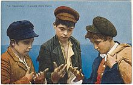

# morra



Sia $G$ un insieme di giocatori $g_1, g_2, \ldots, g_n$. In un giro di morra tra questi giocatori essi si coordinano affinchè, il più simultaneamente possibile, ciascun giocatore $i$ generi ed invii a tutti gli altri due numeri naturali $m_i\in [0,4]$ ed $s_i\in [0,4n]$.
A seguito di un tale giro di morra viene accreditato un punto a ciascun giocatore $i$ per cui risulti $s_i = \sum_{i=1}^n m_i$.   

Cominciamo con l'implementare questo meccanismo fondamntale per il caso di due giocatori ($n=2$), uno è il server (S) e l'altro il dispositivo in locale (L) di un singolo studente. Essi comunicano su un canale bidirezionale secondo il seguente protocollo. 

Indipendentemente dal fatto che siano inviate da S oppure da L, le righe che iniziano col carattere '!' comunicano la chiusura del canale, la riga può comunque proseguire con un commento.
Le righe che iniziano col carattere cancelletto '#' sono commenti, e possono essere inviati in modo del tutto asincrono.
Per proporre un giro di morra S invia una riga col solo carattere '?'.
In seguito, senza un ordine stabilito, ciascun X in {S,L} genera una stringa random di 10 caratteri, e la invia sul canale (chiamiamo $r_X$ la stringa generata da X).
Dopo aver ricevuto la stringa dell'avversario, X invia sul canale una riga che inizia col carattere '>' cui segue la SHA-1 di un messaggio $m_X$ che ha per prefisso la stringa random offerta dall'avversario, prosegue con una seconda stringa random di 20 caratteri generata al momento, e conclude con le due cifre $m\in [0,4]$ ed $s\in [0,8]$ che intende giocare (senza spazi).
Dopo aver ricevuto la SHA-1 prodotta dall'avversario,
ciascun giocatore espone in chiaro il proprio mssaggio $m_X$ di cui aveva precedentemente inviato la SHA-1.
In questo modo è possibile verificare, da parte di entrambi i giocatori, che le giocate di morra sono state una indipendente dall'altra.
Viene accreditato un punto a quel giocatore che ha offerto un $s$ pari alla somma dei due $m$ prodotti, uno da sè stesso e l'altro dall'avversario.   
Oltre a proporre un giro di morra il server può offrire il conteggio attuale dei punti, in questo caso invia una riga che invece che iniziare col carattere '?' inizia col carattere 'p' ed ha il formato:
```
p punti_di_S punti_di_L   
```

Esempio di interazione (nell'esempio, le righe che iniziano con "S> " sono quelle inviate dal server, mentre quelle inviate dal tuo dispositivo locale sono prefissate con "L> "):
```
S> # buongiorno!
S> ?
L> 1234567890
S> TFf&6JH)8/
S> SHA-1(1234567890jF%&DP) Y/&& %/& /&/47)
L> SHA-1(TFf&6JH)8/1234567890123456789048)
S> # questo giro lo hai vinto tù. 
S> ! :)
```

Servizi offerti:

```
> TAlight ...

```

Prego dettagliare i servizi offerti e la modalità per richiederli ...